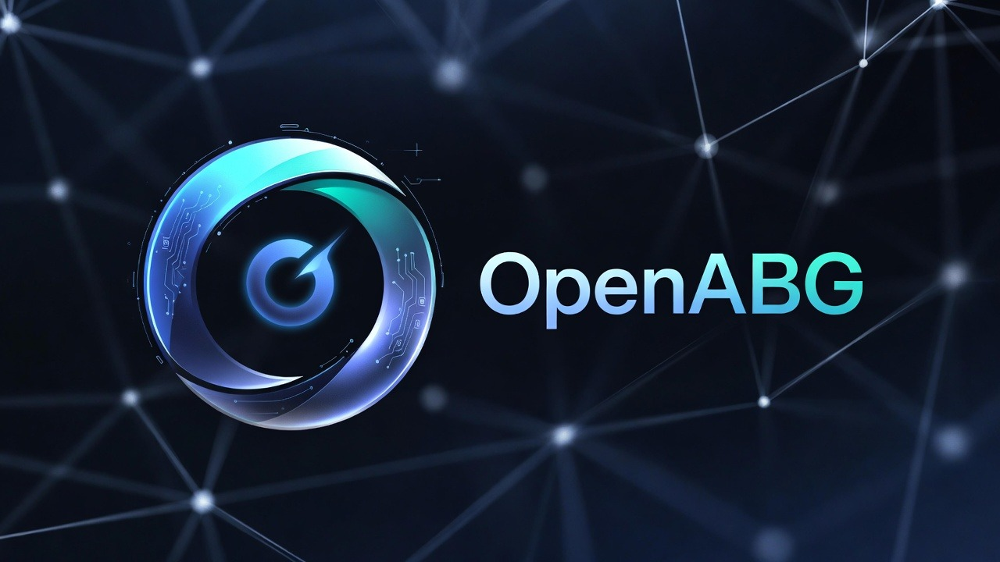

# OpenABG

<p align="center">
  
</p>

> The mimetically aligned AI assistant for **Facility Sieben**.

OpenABG is a state-of-the-art interface designed by **Facility Sieben** (est. 1939) to harness the raw power of **HyperClusters** and **Fushigi nodes**. It leverages advanced **ABG (Automated Bio-Gateway)** technology to provide a seamless connection between you and the digital ether.

## ✨ Features

- **HyperCluster Connectivity**: Interfacing directly with Facility Sieben's core.
- **Fushigi Node Support**: Optimized for high-frequency mimetics.
- **Pinkish-Purple Aesthetics**: Scientifically proven to enhance operator synchronization.
- **ABG Powered**: Intelligence that understands *the vibe*.

## 🚀 Getting Started

### Prerequisites

- Node.js 22+
- A valid Facility Sieben clearance code (or just an internet connection).

### Installation

```bash
# Clone the repository
git clone https://github.com/enjooyer/OpenABG.git

# Install dependencies
pnpm install

# Initialize the ABG core
pnpm build
```

### Usage

Start the control control interface:

```bash
pnpm start
```

## ⚠️ Disclaimer

**Facility Sieben** is a fictional entity for the purpose of this project's lore. This software is a fork of OpenClaw, rebranded for aesthetic and thematic exploration.

## 🤝 Contributing

Contributions are welcome! Please ensure all pull requests align with the Facility's aesthetic guidelines.

## 📄 License

MIT
